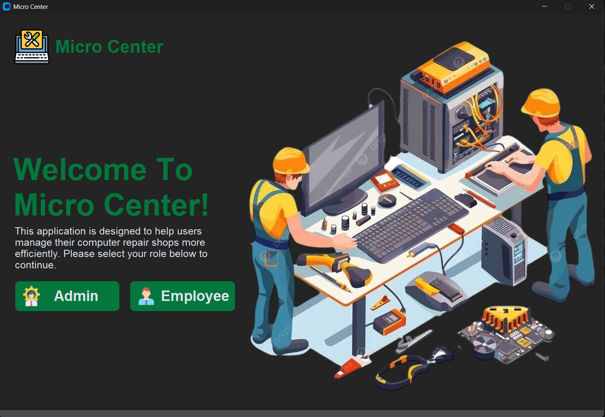
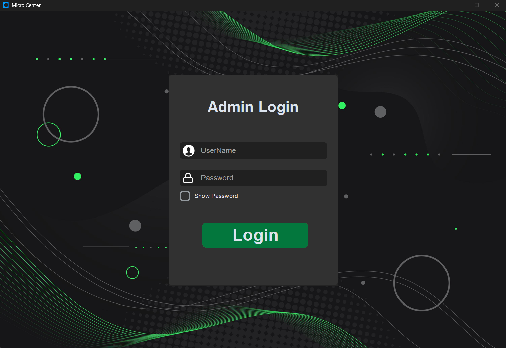
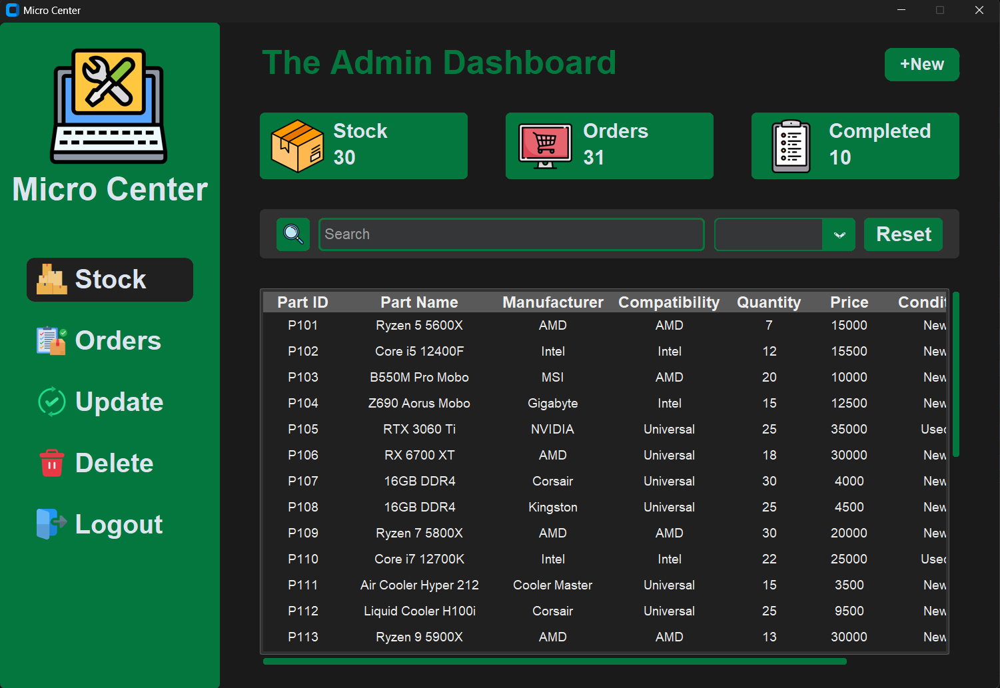
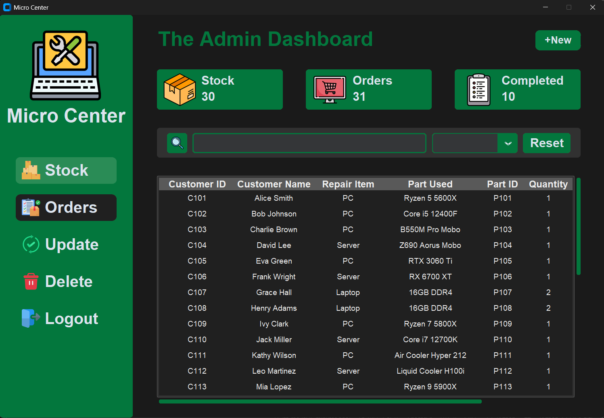
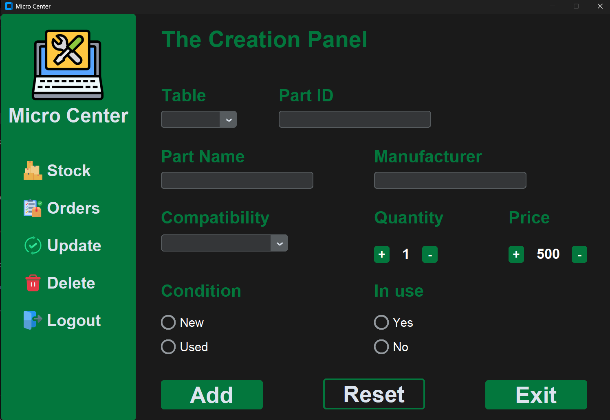
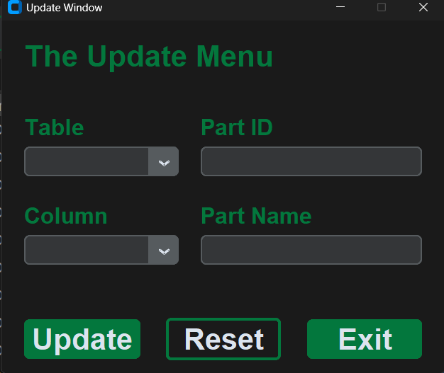
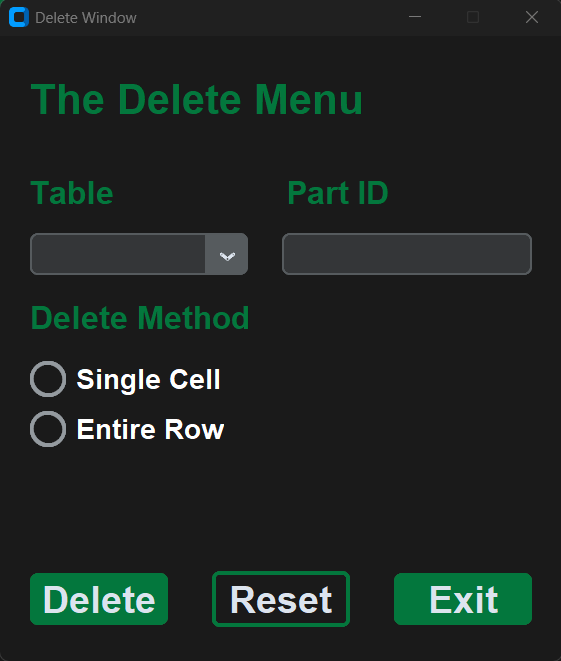

# 🖥️ Micro Center

A desktop inventory and repair-order management system for a PC repair shop, built with **CustomTkinter** and **MySQL**. Supports role-based Admin/Employee login, live stock and order tracking, and full CRUD across both tables — all wrapped in a custom dark theme.

> 🎓 **This was originally built as a school project.** It's shared here as a portfolio piece — not intended for production/commercial use as-is (see [Security Notes](#-security-notes) for details).


---

## 📋 Table of Contents
- [Features](#-features)
- [Screenshots](#-screenshots)
- [Tech Stack](#-tech-stack)
- [Getting Started](#-getting-started)
- [Managing Users & Passwords](#-managing-users--passwords)
- [Security Notes](#-security-notes)
- [Project Structure](#-project-structure)
- [Credits](#-credits)

---

## ✨ Features
- 🔐 Role-based login (Admin / Employee)
- 📊 Live dashboard — total stock, total orders, completed orders at a glance
- ➕ Add, ✏️ update, 🗑️ delete, and 🔍 search records across both Stock and Orders tables
- 🎨 Custom dark UI theme (forest-dark ttk theme)

---

## 🖼️ Screenshots

### Welcome Screen


### Login


### Admin Dashboard — Stock


### Admin Dashboard — Orders


### Add Record


### Update Record


### Delete Record


---

## 🛠️ Tech Stack
| Layer      | Technology |
|------------|------------|
| GUI        | [CustomTkinter](https://github.com/TomSchimansky/CustomTkinter), `ttk` (forest-dark theme) |
| Database   | MySQL (via `mysql-connector-python`) |
| Language   | Python 3 |
| Config     | `python-dotenv` for environment variables |

---

## 🚀 Getting Started

### Prerequisites
- Python 3.10+
- A running MySQL server

### Installation
1. Clone the repo:
   ```bash
   git clone https://github.com/yourusername/your-repo-name.git
   cd your-repo-name
   ```
2. Install dependencies:
   ```bash
   pip install -r requirements.txt
   ```
3. Copy `.env.example` to `.env` and fill in your MySQL credentials:
   ```
   DB_HOST=localhost
   DB_USER=root
   DB_PASSWORD=your_password_here
   ```
4. Run the app:
   ```bash
   python app.py
   ```

---

## 👤 Managing Users & Passwords
Login credentials are stored directly in `app.py`, in the login section near the top of the file:
```python
au=["A001","A002"]
eu=["E001","E002"]
apas=["admlogin123"]
epas=["emplogin123"]
```
- `au` / `eu` — valid Admin / Employee usernames
- `apas` / `epas` — valid Admin / Employee passwords

To add or change a user, edit these lists directly and save the file. For example, to add a new admin: `au=["A001","A002","A003"]`.

---

## 🔒 Security Notes
This started as a school project and has been cleaned up a bit for a public repo:
- ✅ Database credentials are read from `.env` (git-ignored) instead of being hardcoded
- ✅ All SQL insert statements use parameterized queries (`%s` placeholders) to prevent SQL injection
- ⚠️ Login usernames/passwords are still plaintext lists in `app.py` — fine for a local school project, but hashing them (e.g. with `bcrypt`) would be the next step for anything user-facing

---

## 📁 Project Structure
```
├── app.py                 # Main application
├── icons/                 # All UI images (logo, buttons, backgrounds)
├── forest-dark.tcl        # ttk dark theme
├── forest-dark/           # Theme assets
├── screenshots/           # README images
├── requirements.txt
├── .env.example
└── README.md
```

---

## 🙏 Credits
Built as a school project. Inspiration credit to be added.
